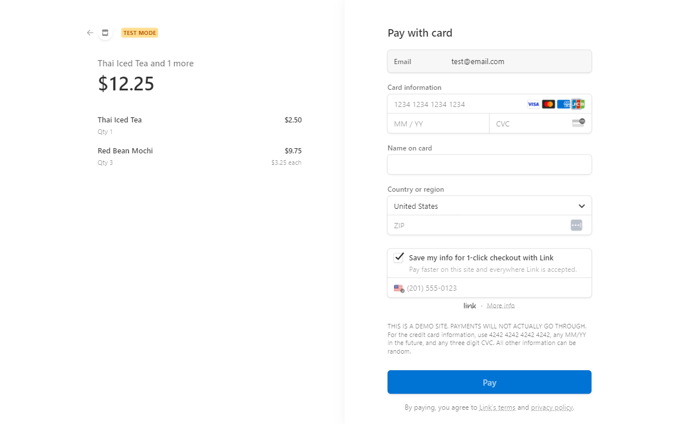

<h1 align="center">Citron Café</h1>

A replica café website that showcases the store's branding and enables users to browse and shop for menu items, utilizing a shopping cart and online check-out.

<a  href="https://citron-cafe.netlify.app"  target="_blank">Live Demo</a>

 

## Features 
### Infinite Autoplay Hero Slides

* The <a  href="https://www.npmjs.com/package/react-responsive-carousel"  target="_blank">react-responsive-carousel</a> is used for the hero slider.
* Slide images transition every 4.5 seconds, with the last slide transitioning smoothly to the first image again. 
### Display Choice Images 

* An array of images is mapped to a CSS grid layout. 
* On image hover, an Instagram logo appears which would link to the post. 
### Add Item From Menu 

* Clicking on each item pops up a control. A quantity of item can be chosen and added directly to the shopping bag. 
* localStorage (Web Storage API) prevents the shopping bag from resetting every time the page is refreshed. 
* Each time localStorage is updated, the shopping bag icon in the navigation bar relects the change in total item quantity. 
### Shopping Bag

* Items added appear in the shopping bag from localStorage. 
* Bag functionalities include: change quantities, delete items, clear bag.
* Each bag function also modifies the state of the shopping bag in localStorage which then reflects to the navigation bar.  
* Check-out button is disabled if the shopping bag is empty. 
### Check Out 

* The shopping cart is connected to the Stripe API for checkout.
* Once the transaction is initiated, Stripe takes charge and, upon successful processing, redirects the user back to the café website.
### Responsive Design
* This design is responsive from desktop to mobile devices through CSS media queries. 

 

