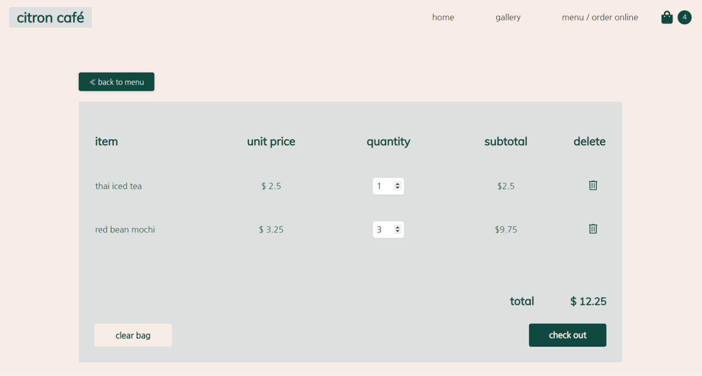
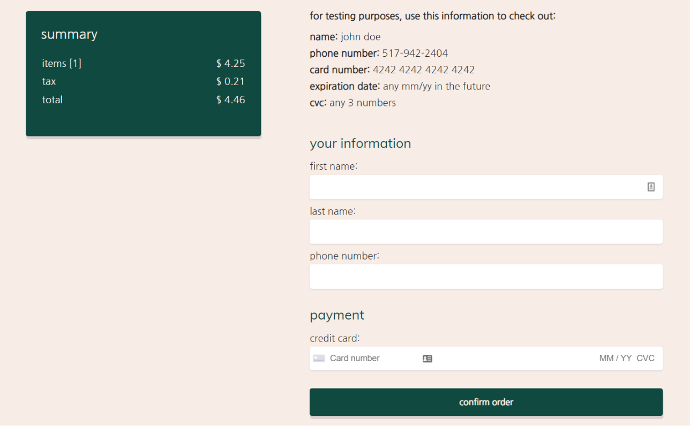

<h1 align="center">Citron Café</h1>
<h2 align="center"><a  href="https://chloetran.ml/citron-cafe"  target="_blank">Live Demo</a></h2>


<p align="center"> A responsive website for a replica cafe.</p>

## Table of Contents

- [Table of contents](#table-of-contents)
- [Development](#development)
  - [Local Installation](#local-installation)
  - [Tools Used](#tools-used)
- [Features](#features)
  - [Infinite Autoplay Hero Slides](#infinite-autoplay-hero-slides)
  - [Display Choice Images](#display-choice-images)
  - [Add Item From Menu](#add-item-from-menu)
  - [Shopping Bag](#shopping-bag)
  - [Check Out](#check-out)
  - [Responsive Design](#responsive-design)
  - [Credit Card and Phone Number Formatting](#credit-card-and-phone-number-formatting)
- [Future Work](#future-work)

## Development 
### Local Installation 
```
git clone https://github.com/chloe-trn/citron-cafe.git
cd citron-cafe
npm install 
npm run start 
```
### Tools Used 
<p>

 


</p>

* This website is created with React, React Router, JavaScript [incorporating ES6 syntax], and CSS. 
* NPM is used to manage dependencies. 
* High fidelity wireframes of the website design were created before deployment in Figma and Adobe XD.
* The React front-end of the website is deployed on GitHub Pages. 

<p>

 
</p>

* UPDATE as of 3/16/2021 - All code has been refactored for maintainability and better React architecture
* The website now integrates the NodeJS webframework Express which is deployed on the Heroku cloud.  
 
## Features 
### Infinite Autoplay Hero Slides

* The <a  href="https://www.npmjs.com/package/react-responsive-carousel"  target="_blank">react-responsive-carousel</a> is used for the hero slider.
* Slide images transition every 4.5 seconds, with the last slide transitioning smoothly to the first image again. 
### Display Choice Images 

* An array of images is mapped to a CSS grid layout. 
* On image hover, an Instagram logo appears which would link to the post. 
### Add Item From Menu 

* Clicking on each item pops up a control. A quantity of item can be chosen and added directly to the shopping bag. 
* localStorage (Web Storage API) prevents the shopping bag from resetting every time the page is refreshed. 
* Each time localStorage is updated, the shopping bag icon in the navigation bar relects the change in total item quantity. 
### Shopping Bag

* Items added appear in the shopping bag from localStorage. 
* Bag functionalities include: change quantities, delete items, clear bag.
* Each bag function also modifies the state of the shopping bag in localStorage which then reflects to the navigation bar.  
* Check-out button is disabled if the shopping bag is empty. 
### Check Out 

* Summary box displays total purchase price with tax included. 
* Check out form only lets purchase go through if required fields are correctly input. 
### Responsive Design
<p align="middle">

 


</p>

* This design scales down to mobile devices through CSS media queries. 

## Credit Card and Phone Number Real Time Formatting 
* The <a  href="https://www.npmjs.com/package/react-phone-number-input"  target="_blank">react-phone-number-input</a> is used for phone number formattting 
* <a  href="https://stripe.com/"  target="_blank">Stripe</a> is used for front-end credit card number validation and formatting. A POST request to the Express server is sent at order submission which returns a response that triggers the loading of a confirmation message through React state. In this way, credit card validation and response was mocked. 

## Future Work 
* Store user input email into a database
* Add individual menu item description pages with pictures. 
